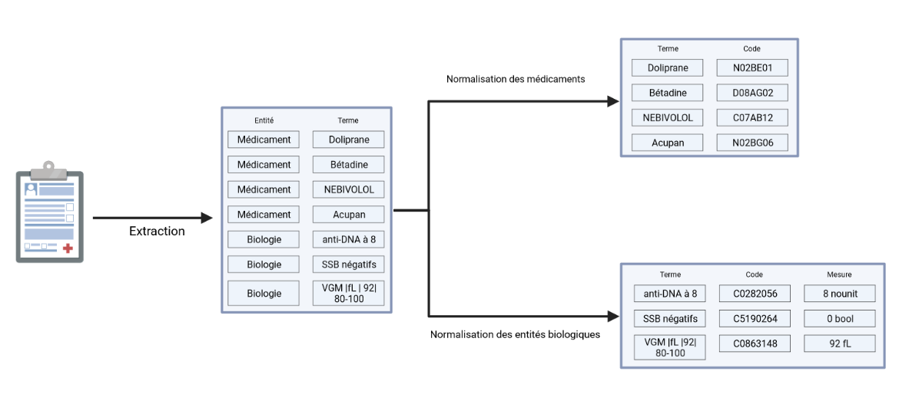
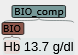

# Presentation of the project
The project at stake is aimed at extracting biological test mentions from raw clinical texts (extracted from PDF files with `eds-pdf`, process not included here), their corresponding measures and normalising these tests mentions, i.e linking each biological test mention to one unique code (for each different concept, i.e different types of test). The final aim of this project is to be able to characterize each patient in order to later compare them. Normalizing biological entities is thus a sub-part of this entire project: we are only characterizing patients with the results of biological tests while we can also characterize each patient for example by the medicine that he takes, the disease he used to have...

# Architecture of the project
To normalize all biological tests in a clinical test, we use the architecture described in the image below: 

We only take our interest in the full pipe from extraction to normalization OF BIOLOGICAL ENTITIES. We can divide our work in three parts:
1. Extraction of the biological test mentions from raw clinical texts
2. Extraction of the measures of the biological test mentionned in the clinical raw text
3. Normalisation of the extracted biological test mentions

## 1. Extraction of the biological test mentions from raw clinical texts
During inference, this pipe should take raw clinical texts as input and give as output a list of all biological test mentions. In particular, this pipe should give in a perfect world a list of strings labeled:
- BIO: the raw biological test mention in the text
- BIO_comp: the raw entity composed of biological test mention + Its corresponding measure
Actually, this list is stored in `BRAT` format (i.e a `X.txt` file + `X.ann` file). You can see an examples of the structure of such files in `/export/home/cse200093/brat_data/NLP-diabeto/post_bio_chem_devi_diso_bioComp`. A visualisation of the interpretation of these files is also possible via [this link](https://brat-cse200093.eds.aphp.fr/). A version of the SoA model returning annotated spacy `doc` also exists and may be used instead to allow full integration in `edsnlp` library. However, this would involve changing all the input formatting output formatting of the parts `2.` and `3.`.

Please note that what take our interest here are biological tests with their corresponding measure. However, sometimes, in the clinical texts, we can find mentions of biological tests without any result. These mentions are useless for us, but for evaluation purpose, It may still be important to maximise the performance of the extraction of biological test without measure mention.

It's also worth noting that sometimes, when the clinical document contains a biological test with Its measure, our NER may only match a `BIO_comp` entity without the `BIO` entity inside of It. However, in a perfect world, each `BIO_comp` should be linked to a `BIO`, but that's not the case right now: ~1% of `BIO_comp` does not overlap any `BIO` with our SoA model.

Example:

Here `Hb` is measured with the result `13.7 g/dl`. That's why the `BIO` entity we should extract is `Hb` and the `BIO_comp` entity we should extract is `Hb 13.7 g/dl`. However, in pathological cases, the NER only achieve to extract the `BIO_comp` entity without Its linked `BIO`. This may be problematic for the normalisation process, where what we want to normalize is the biological test alone, and not the biological test with Its measure.

## 2. Extraction of the measures of the biological test mentionned in the clinical raw text
During inference, this pipe should take as input a text with labeled biology test as described in `1.` in `BRAT` format. It should return a table with each row composed of at least:
- A `BIO_comp` entity
- A `BIO` entity linked to the `BIO_comp`
- The measure contained in the `BIO_comp` in a formatted way
An output as annotations in a spacy `doc` or a BRAT file may be considered, but right now, what is returned is an export of a Pandas DataFrame.

## 3. Normalisation of the extracted biological test mentions
During inference, this pipe should take as input a list of `BIO` terms, for example the one extracted from the table generated in `2.`, and as an output a table with each row composed of at least:
- A `BIO` entity
- Its normalised code
An output as annotations in a spacy `doc` as a BRAT file may be also considered, but right now, what is returned is an export of a Pandas DataFrame.

# Other comments

## Final method used for each parts
While we have developped a solution for all parts of the pipe `1.`, `2.` and `3.`, only the solutions developped for parts `2.` and `3.` are used in the full pipe, since a better alternative was found by Pierre PAGES for part `1.`. As of time of writing this `README.md`, the SoA solution for part `1.` is in folder `/export/home/cse200093/Pierre-Medic`. However, the work we have done to solve part `1.` but not used in the full pipe is still kept in case of reuse in `/export/home/cse200093/Jacques_Bio`.

## Possible parallelization
Note that in the diagram, the normalization includes extraction of measures and linking of biological test mentions to a code. In fact, both steps `2.` and `3.` can almost be parallelized since the extraction of the measure is done through parts of the text different from the parts used for linking the biological test mentions to codes, but this work has not been done yet. The main problem is that sometimes the part `2.` helps part `3.` to focus on the right term to normalize: when we cannot link one `BIO_comp` to one `BIO`, we deduce the `BIO` entity from the `BIO_comp` by removing all terms that is measurement related thanks to part `2.` before sending the `BIO` we find that way in the part `3.`.
